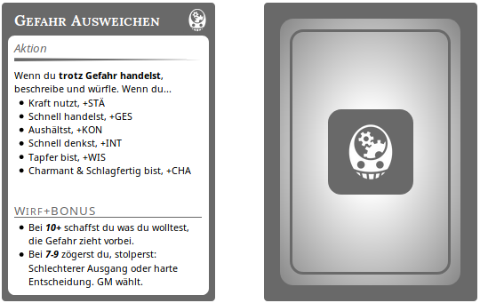

# Dungeon World Karten

## Skripte zum Generieren von DW Karten

### Skripte

#### create_cards.py
Erstellen von cards.json, welche auf [RPG-Cards](https://crobi.github.io/rpg-cards/generator/generate.html) hochgeladen werden kann.
Es werden nur Karten erstellt für welche sowohl ein übersetzter Titel in [title_translations.json](title_translations.json) als auch eine übersetzte
Beschreibung in [description_translations.json](description_translations.json) zur Verfügung steht.

#### translate_title.py
Interaktiv Übersetzungen für Titel von Aktionen hinzufügen.

Titel sollten nicht zu lang sein und nicht eins zu eins übersetzt werden.

#### translate_description.py
Interaktiv Übersetzungen für Beschreibungen von Aktionen hinzufügen.

Beschreibungen sollten einigen Richtlinien folgen.

- Stichpunkte sind Zeilen die mit `- ` beginnen und werden später als solcher dargestellt
- Würfelergebnisse sollten in einzelnen Zeilen stehen und mit `-> Bei 10+ ...` beginnen.
  `On a miss` sollte zu `-> Bei Fehlschlag ...` übersetzt werden.
- Würfe sollten in einer neuen Zeile stehen und mit `Wirf` beginnen. (Zum Beispiel `Wirf+KON`) Dies wird dann zu einer `section` geändert,
  welche sich am Boden der Karte befindet. Nach dieser `section` sollten alle Ausgangsergebnisse folgen.
- Hat die Aktion einen Auslöser so sollte dieser in ** eingefasst werden (Zum Beispiel `Wenn du **die Richtlinien für Übersetzungen verfasst**, dann...`)
- Zahlen und Würfelergebnisse werden später kursiv dargestellt.

## Danksagungen

Daten kommen von [DungeonWorldData](https://github.com/Vindexus/DungeonWorldData), vielen Dank an [Vindexus](https://github.com/Vindexus).

Das Originalspiel [Dungeon World](http://www.dungeon-world.com/) ist Grundlage für diese Karten, vielen Dank an [Sage LaTorra](http://www.latorra.org/) und [Adam Koebel](https://www.adam-koebel.com/).

Die Karten werden mit [RPG-Cards](https://github.com/crobi/rpg-cards) erstellt, vielen Dank dafür!
